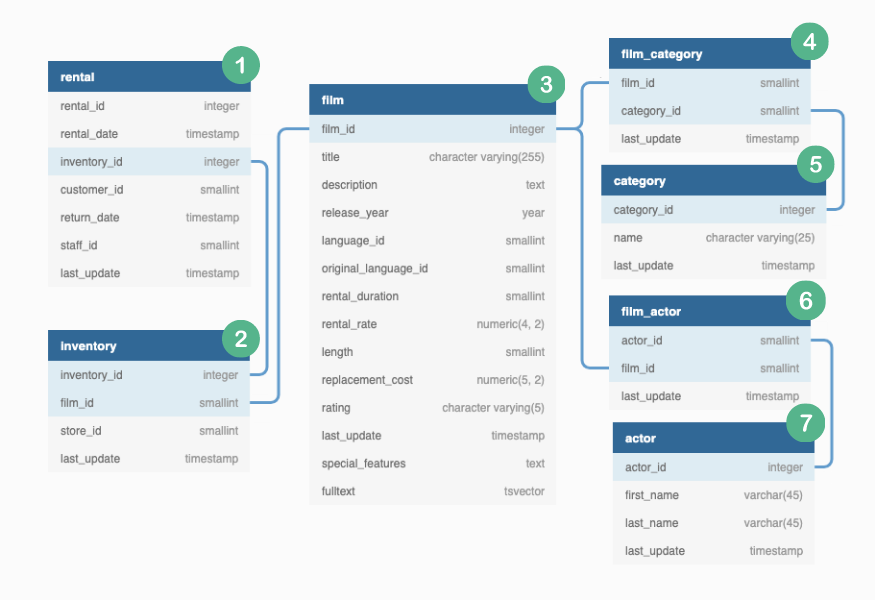

# Join Implementation Part 1

The focus for this first part was on generating a base table for the category insights.

The table below would be the final output table for the category insights, that is why is important to get the base table first.

| customer_id | category_ranking | category_name | rental_count | average_comparison | percentile | category_percentage |
|-------------|------------------|---------------|--------------|--------------------|------------|---------------------|
| 1           | 1                | Classics      | 6            | 4                  | 1          | 19                  |
| 1           | 2                | Comedy        | 5            | 4                  | 2          | 16                  |
| 2           | 1                | Sports        | 5            | 3                  | 7          | 19                  |
| 2           | 2                | Classics      | 4            | 2                  | 11         | 15                  |

From the table above I noticed that the columns of ``average_comparison``, ``percentile`` and ``category_percentage`` needed the ``rental_count`` column for its calculations. 

Then the focus would be on generating table that includes the ``customer_id``, ``category_name`` and ``rental_count``.

| customer_id | category_name | rental_count |
|-------------|---------------|--------------|
| 1           | Classics      | 6            |
| 1           | Comedy        | 5            |
| 2           | Sports        | 5            |
| 2           | Classics      | 4            |

To be able to generate the outout from above, table joins were requiered since the ``customer_id`` and the ``category_name`` data was not in the same table.

## Table Journey 

When looking at the ERD, the table joins would be from table 1 to table 5.



**The table joining journey for the catagory insights base table:**

| Join Journey Part | Start         | End           | Foreign Key  |
|-------------------|---------------|---------------|--------------|
| Part 1            | ``rental``        | ``inventory``     | ``inventory_id`` |
| Part 2            | ``inventory``     | ``film``          | ``film_id``      |
| Part 3            | ``film``          | ``film_category`` | ``film_id``      |
| Part 4            | ``film_category`` | ``category``      | ``category_id``  |

Each start and end point was analyzed in depth to proceed each joining journey with confidence.

Before joining the tables, i had to see which table join i should use by answering the following questions:  

    1. What is the purpose of joining these two tables?

    a. What contextual hypotheses do we have about the data?

    b. How can we validate these assumptions?

    2. What is the distribution of foreign keys within each table?

    3. How many overlapping and missing unique foreign key values are there between the two tables?

The questions were answered first for the ``rental`` and ``inventory`` tables which is the join journey part 1.

## Join Journey Part 1

### 1. What is the purpose of joining these two tables?

The ``rental`` table does not track the records at the ``film_id`` but tracks the records with the ``inventory_id``.

| rental_id | rental_date              | inventory_id | customer_id | return_date              | staff_id | last_update              |
|-----------|--------------------------|--------------|-------------|--------------------------|----------|--------------------------|
| 1         | 2005-05-24T22:53:30.000Z | 367          | 130         | 2005-05-26T22:04:30.000Z | 1        | 2006-02-15T21:30:53.000Z |
| 2         | 2005-05-24T22:54:33.000Z | 1525         | 459         | 2005-05-28T19:40:33.000Z | 1        | 2006-02-15T21:30:53.000Z |

The join with the ``inventory`` table helps to get the ``film_id`` of each rental because it matches up each rental record with its equivalent ``film_id`` value from the ``inventory`` table.

### a. & b. What contextual hypotheses do we have about the data and how can we validate it?

The rental table contains every single rental for each customer so each valid rental record in the rental table should have a relevant ``inventory_id`` record.

Every item in the inventory table should have a unique ``inventory_id`` but there may also be multiple copies of a specific film.

**Hypothesis 1:**

> **The number of unique ``inventory_id`` records will be equal in both ``rental`` and ``inventory`` tables**

**Rental results:**

````sql
SELECT 
  COUNT(DISTINCT inventory_id)
FROM dvd_rentals.rental;
````    
| count |
|-------|
| 4580  |

**Inventory results:**

```sql
SELECT 
  COUNT(DISTINCT inventory_id)
FROM dvd_rentals.inventory;
```

| count |
|-------|
| 4581  |

**Findings**

There was one additional ``inventory_id`` value in the ``inventory`` table.

**Hypothesis 2:**

> **There will be a multiple records per unique ``inventory_id`` in the ``rental`` table**

```sql
-- generate group by counts on the target_column_values column
WITH counts_base AS(
  SELECT 
    inventory_id,
    COUNT(*) AS row_counts
  FROM dvd_rentals.rental
  GROUP BY inventory_id
)
-- summarize the group by counts above by grouping again on the row_counts from counts_base CTE part
SELECT 
  row_counts,
  COUNT(inventory_id) AS count_inventory_ids
FROM counts_base
GROUP BY row_counts
ORDER BY row_counts;
```

| row_counts | count_inventory_ids |
|------------|---------------------|
| 1          | 4                   |
| 2          | 1126                |
| 3          | 1151                |
| 4          | 1160                |
| 5          | 1139                |

**Findings**

There were multiple records per ``inventory_id`` value in the ``rental`` table.

**Hypothesis 3:**

> **There will be multiple ``inventory_id`` records per unique ``film_id`` value in the inventory table**

```sql
-- generate group by counts on the target_column_values column
WITH counts_base AS(
  SELECT 
    film_id,
    COUNT(DISTINCT inventory_id) AS unique_record_counts
  FROM dvd_rentals.inventory
  GROUP BY film_id
)
-- summarize the group by counts above by grouping again on the row_counts from counts_base CTE part
SELECT 
  unique_record_counts,
  COUNT(film_id) AS count_film_ids
FROM counts_base
GROUP BY unique_record_counts
ORDER BY unique_record_counts;
```

| unique_record_counts | count_film_ids |
|------------|----------------|
| 2          | 133            |
| 3          | 131            |
| 4          | 183            |
| 5          | 136            |
| 6          | 187            |
| 7          | 116            |
| 8          | 72             |

**Findings**

There were multiple unique ``inventory_id`` per ``film_id`` value in the ``inventory`` table.

### 2. What is the distribution of foreign keys within each table?

``rental`` distribution analysis on ``inventory_id`` foreign key:
```sql
-- first generate group by counts on the inventory_id column
WITH counts_base AS(
  SELECT 
    inventory_id,
    COUNT(*) AS row_counts
  FROM dvd_rentals.rental
  GROUP BY inventory_id
)
-- summarize the group by counts above by grouping again on the row_counts from counts_base CTE part
SELECT 
  row_counts,
  COUNT(inventory_id) AS count_foreign_key_values
FROM counts_base
GROUP BY row_counts
ORDER BY row_counts;
```
| row_counts | count_foreign_key_values |
|------------|---------------------|
| 1          | 4                   |
| 2          | 1126                |
| 3          | 1151                |
| 4          | 1160                |
| 5          | 1139                |

``inventory`` distribution analysis on ``inventory_id`` foreign key
```sql
-- first generate group by counts on the inventory_id column
WITH counts_base AS(
  SELECT 
    inventory_id,
    COUNT(*) AS row_counts
  FROM dvd_rentals.inventory
  GROUP BY inventory_id
)
-- summarize the group by counts above by grouping again on the row_counts from counts_base CTE part
SELECT 
  row_counts,
  COUNT(inventory_id) AS count_foreign_key_values
FROM counts_base
GROUP BY row_counts
ORDER BY row_counts;
```

| row_counts | count_foreign_key_values |
|------------|---------------------|
| 1          | 4581                   |

**Findings**

In the ``rental`` table there were multiple row counts for some values of ``inventory_id`` which meant there is a 1 to many relationship for the ``inventory_id`` in the ``rental`` table. 

In the ``inventory`` table there was only 1 table row record per ``inventory_id`` which means there is a 1-to-1 relationship.

### 3. How many overlapping and missing unique foreign key values are there between the two tables?

**Rental Table**

By using an anti join, the foreign keys which only exist in the ``rental`` table and not in the ``inventory`` table can be seen.

```sql
-- how many foreign keys only exist in the left table and not in the right?
SELECT
  COUNT(DISTINCT inventory_id)
FROM dvd_rentals.rental
WHERE NOT EXISTS (
  SELECT inventory_id
  FROM dvd_rentals.inventory
  WHERE rental.inventory_id = inventory.inventory_id
);
```
| count |
|-------|
| 0     |

**Findings**

The ``inventory_id`` values from the rental table were also in the ``inventory`` table as well.

**Inventory Table**

The unique foreign keys that only exists in the ``inventory`` table and not in the ``rental`` table were also checked.

```sql
SELECT
  COUNT(DISTINCT inventory_id)
FROM dvd_rentals.inventory
WHERE NOT EXISTS (
  SELECT inventory_id
  FROM dvd_rentals.rental
  WHERE inventory.inventory_id = rental.inventory_id
);
```
| count |
|-------|
| 1     |

There was one ``inventory_id`` value which is not in the ``rental`` table. 

This one value was checked:

```sql
SELECT *
FROM dvd_rentals.inventory
WHERE NOT EXISTS (
  SELECT inventory_id
  FROM dvd_rentals.rental
  WHERE inventory.inventory_id = rental.inventory_id
);
```

| inventory_id | film_id | store_id | last_update              |
|--------------|---------|----------|--------------------------|
| 5            | 1       | 2        | 2006-02-15T05:09:17.000Z |

The ``inventory_id`` was linked to a specific film. It could be that the film might have never been rented by a customer.

I also got the count of foreign key values from the intersection of both tables using a left semi join  or a ``WHERE EXISTS``

```sql
SELECT 
  COUNT(DISTINCT inventory_id)
FROM dvd_rentals.rental
WHERE EXISTS (
  SELECT inventory_id
  FROM dvd_rentals.inventory
  WHERE rental.inventory_id = inventory.inventory_id 
);
```
| count |
|-------|
| 4580  |

**Findings**

This was the same number of the output from  hypothesis 1 which was the distinct count from the ``rental`` table.

After this analysis the conclusion was that it does not matter if a ``left join`` or a ``inner join`` is used to join the ``rental`` and ``inventory`` tables.

### Left Join or Inner Join?

Both left and inner joins were implemented to validate that the raw row counts output would be same for both joins.

```sql
DROP TABLE IF EXISTS left_rental_join;
CREATE TEMP TABLE left_rental_join AS
SELECT 
  rental.customer_id,
  rental.inventory_id,
  inventory.film_id
FROM dvd_rentals.rental
LEFT JOIN dvd_rentals.inventory
  ON rental.inventory_id = inventory.inventory_id;
  
DROP TABLE IF EXISTS inner_rental_join;
CREATE TEMP TABLE inner_rental_join AS 
SELECT 
  rental.customer_id,
  rental.inventory_id,
  inventory.film_id
FROM dvd_rentals.rental
INNER JOIN dvd_rentals.inventory
  ON rental.inventory_id = inventory.inventory_id;
  
-- check the counts for each output
(
  SELECT
    'left join' AS join_type,
    COUNT(*) AS record_count,
    COUNT(DISTINCT inventory_id) AS unique_key_values
  FROM left_rental_join
)

UNION 

(
  SELECT
    'inner join' AS join_type,
    COUNT(*) AS record_count,
    COUNT(DISTINCT inventory_id) AS unique_key_values
  FROM inner_rental_join
)
```

| join_type  | record_count | unique_key_values |
|------------|--------------|-------------------|
| inner join | 16044        | 4580              |
| left join  | 16044        | 4580              |

As seen in the table above it did not matter which join was used, the output was the same for the inner and left join.

### Next Table Journies 

All of these questions and analysis were done for every join journey part. To not make the main part too long, the rest of the analysis is in the appendix. 

## Final Ouput 

The table joins to create the base table for the category insights is shown below

```sql
DROP TABLE IF EXISTS complete_join_dataset;
CREATE TEMP TABLE complete_join_dataset AS
SELECT 
  rental.customer_id,
  inventory.film_id,
  film.title,
  film_category.category_id,
  category.name AS category_name
FROM dvd_rentals.rental
INNER JOIN dvd_rentals.inventory
  ON rental.inventory_id = inventory.inventory_id
INNER JOIN dvd_rentals.film
  ON inventory.film_id = film.film_id
INNER JOIN dvd_rentals.film_category
  ON film.film_id = film_category.film_id
INNER JOIN dvd_rentals.category
  ON film_category.category_id = category.category_id;
  
SELECT *
FROM complete_join_dataset
LIMIT 5;
```
| customer_id | film_id | title           | category_id | category_name |
|-------------|---------|-----------------|-------------|---------------|
| 130         | 80      | BLANKET BEVERLY | 8           | Family        |
| 459         | 333     | FREAKY POCUS    | 12          | Music         |
| 408         | 373     | GRADUATE LORD   | 3           | Children      |
| 333         | 535     | LOVE SUICIDES   | 11          | Horror        |
| 222         | 450     | IDOLS SNATCHERS | 3           | Children      |


## Join Implementation Part 2
The base table for the actor insights was generated for the next join implementation part.

Please click on the link below to go to the next part.

[](https://github.com)

# Appendix

## Join Journey Part 2

### 1. What is the purpose of joining these two tables?

Match the films on ``film_id`` to obtain the ``title`` of each film.

### a. & b. What contextual hypotheses do we have about the data and how can we validate it?

**Hypothesis 1:**

> **There will be multiple records per unique ``film_id`` in the ``inventory`` table since one specific film might have multiple copies to be rented at the store.**

```sql
WITH counts_base AS (
  SELECT
    film_id,
    COUNT(film_id) AS row_counts
  FROM
    dvd_rentals.inventory
  GROUP BY film_id
)
SELECT
  row_counts,
  COUNT(DISTINCT film_id) AS unique_film_id_values
FROM counts_base
GROUP BY row_counts
ORDER BY row_counts;
```
| row_counts | unique_film_id_values |
|------------|-----------------------|
| 2          | 133                   |
| 3          | 131                   |
| 4          | 183                   |
| 5          | 136                   |
| 6          | 187                   |
| 7          | 116                   |
| 8          | 72                    |

**Findings**

There were multiple records per ``film_id`` value in the ``inventory`` table.

**Hypothesis 2:**

> **In the film table there should be a 1-to-1 relationship for the ``film_id`` since it would not make sense to have duplicate ``film_id`` values.**

```sql
WITH counts_base AS (
  SELECT
    film_id,
    COUNT(film_id) AS row_counts
  FROM
    dvd_rentals.film
  GROUP BY film_id
)
SELECT
  row_counts,
  COUNT(DISTINCT film_id) AS unique_film_id_values
FROM counts_base
GROUP BY row_counts
ORDER BY row_counts;
```
| row_counts | unique_film_id_values |
|------------|-----------------------|
| 1          | 1000                  |

**Findings**

There is a 1-to-1 relationship in the film table. 

### 2. What is the distribution of foreign keys within each table?

This was done with the validation of the hypotheses above.

### 3. How many overlapping and missing unique foreign key values are there between the two tables?

By using an anti join, the foreign keys which only exist in the ``inventory`` table and not in the ``film`` table can be seen.

**Inventory Table**

```sql
SELECT
  COUNT(DISTINCT film_id)
FROM dvd_rentals.inventory
WHERE NOT EXISTS (
  SELECT film_id
  FROM dvd_rentals.film
  WHERE inventory.film_id = film.film_id
);
```

| count      |
|------------|
| 0        |

**Findings**

The ``film_id`` values from the ``inventory`` table exist in the ``film`` table.

**Film Table**

The unique foreign keys that only exists in the ``film`` table and not in the ``inventory`` table were also checked.

```sql
SELECT
  COUNT(DISTINCT film_id)
FROM dvd_rentals.film
WHERE NOT EXISTS (
  SELECT film_id
  FROM dvd_rentals.inventory
  WHERE film.film_id = inventory.film_id 
);
```
| count      |
|------------|
| 42        |

**Findings**

There were 42 foreign key values which are not in the ``inventory`` table.

----------------

The total count of distinct foreign key values was checked using a left semi join between the inventory and the film tables. 

```sql
SELECT 
  COUNT(DISTINCT film_id)
FROM dvd_rentals.inventory
WHERE EXISTS (
  SELECT film_id
  FROM dvd_rentals.film
  WHERE inventory.film_id = film.film_id
);
```
| count      |
|------------|
| 958        |

**Findings**

Once the join was performed 958 distinct ``film_id`` values are expected.

### Left Join or Inner Join?

The left and inner joins were implemented to validate that the raw counts are the same for both joins

```sql
DROP TABLE IF EXISTS left_inventory_join;
CREATE TEMP TABLE left_inventory_join AS 
SELECT 
  inventory.inventory_id,
  inventory.film_id,
  film.title
FROM dvd_rentals.inventory
LEFT JOIN dvd_rentals.film
  ON inventory.film_id = film.film_id;
  
DROP TABLE IF EXISTS inner_inventory_join;
CREATE TEMP TABLE inner_inventory_join AS 
SELECT 
  inventory.inventory_id,
  inventory.film_id,
  film.title
FROM dvd_rentals.inventory
LEFT JOIN dvd_rentals.film
  ON inventory.film_id = film.film_id;
  
(
  SELECT
    'left join' AS join_type,
    COUNT(*) AS record_count,
    COUNT(DISTINCT film_id) AS unique_key_values 
  FROM left_inventory_join
)  

UNION ALL 

(
  SELECT 
    'inner join' AS join_type,
    COUNT(*) AS record_count,
    COUNT(DISTINCT film_id) AS unique_key_values
  FROM inner_inventory_join  
)
```

| join_type  | record_count | unique_key_values |
|------------|--------------|-------------------|
| inner join | 4581        | 958              |
| left join  | 4581        | 958              |

 As seen in the table above, no matter which join is used the output will be the same.

## Join Journey Part 3

### 1. What is the purpose of joining these two tables?

Match the films on ``film_id`` to obtain the ``category_id`` of each film.

### a. & b. What contextual hypotheses do we have about the data and how can we validate it?

**Hypothesis 1:**

> **The number of unique ``film_id`` records will be equal in both ``film`` and ``film_category`` tables**

**Film Table**

```sql
SELECT 
  COUNT(DISTINCT film_id)
FROM dvd_rentals.film;
```
| count      |
|------------|
| 1000        |

**Film_category Table**

```sql
SELECT 
  COUNT(DISTINCT film_id)
FROM dvd_rentals.film_category;
```
| count      |
|------------|
| 1000        |

**Findings**

Both of the tables had the same distinct ``film_id`` values.

**Hypothesis 2:**

> **In the ``film_category`` table there should be a 1-to-1 relationship for the ``film_id``.**

```sql
SELECT 
  film_id,
  COUNT(*) AS value_count
FROM dvd_rentals.film_category
GROUP BY film_id
ORDER BY values_count DESC
LIMIT 5;
```

| film_id | value_count |
|---------|--------------|
| 273     | 1            |
| 51      | 1            |
| 951     | 1            |
| 839     | 1            |
| 652     | 1            |

**Findings**

There is a 1-to-1 relationship in the ``film_category`` table because the value count of the ``film_id`` values appeared only once.

### 2. What is the distribution of foreign keys within each table?

**Film Table**

```sql
WITH count_base AS (
  SELECT 
    film_id,
    COUNT(*) AS row_counts
  FROM dvd_rentals.film
  GROUP BY film_id
)

SELECT 
  row_counts,
  COUNT(DISTINCT film_id) AS count_foreign_key_values
FROM count_base
GROUP BY row_counts
ORDER BY row_counts;
```

| row_counts | unique_film_id_values |
|------------|-----------------------|
| 1          | 1000                  |

**Film_category Table**

```sql
WITH count_base AS (
  SELECT 
    film_id,
    COUNT(*) AS row_counts
  FROM dvd_rentals.film_category
  GROUP BY film_id
)

SELECT 
  row_counts,
  COUNT(DISTINCT film_id) AS count_foreign_key_values
FROM count_base
GROUP BY row_counts
ORDER BY row_counts;
```

| row_counts | unique_film_id_values |
|------------|-----------------------|
| 1          | 1000                  |

**Findings**

There is a 1-to-1 relationship for the ``film_id`` in both ``film`` and ``film_category`` tables.

### 3. How many overlapping and missing unique foreign key values are there between the two tables?

**Film Table**

By using an anti join, the foreign keys which only exist in the ``film`` table and not in the ``film_category`` table can be seen.

```sql
SELECT 
  COUNT(DISTINCT film_id)
FROM dvd_rentals.film
WHERE NOT EXISTS(
  SELECT 
    film_id
  FROM dvd_rentals.film_category
  WHERE film.film_id = film_category.film_id
);
```

| count      |
|------------|
| 0        |

**Film_category Table**

The unique foreign keys that only exists in the ``film_category`` table and not in the ``film`` table were also checked.
```sql
SELECT 
  COUNT(DISTINCT film_id)
FROM dvd_rentals.film_category
WHERE NOT EXISTS(
  SELECT 
    film_id
  FROM dvd_rentals.film
  WHERE film_category.film_id = film.film_id
);
```
| count      |
|------------|
| 0        |

**Findings**

The same ``film_id`` values that were in the ``film`` table were also in the ``film_category`` and vice versa.

### Left Join or Inner Join?

The left and inner joins were implemented to validate that the raw row counts output was the same.

```sql
DROP TABLE IF EXISTS left_film_join;
CREATE TEMP TABLE left_film_join AS 
SELECT 
  film.film_id,
  film.title,
  film_category.category_id
FROM dvd_rentals.film
LEFT JOIN dvd_rentals.film_category
  ON film.film_id = film_category.film_id;
  
DROP TABLE IF EXISTS inner_film_join;
CREATE TEMP TABLE inner_film_join AS 
SELECT 
  film.film_id,
  film.title,
  film_category.category_id
FROM dvd_rentals.film
INNER JOIN dvd_rentals.film_category
  ON film.film_id = film_category.film_id;
  
(
  SELECT
    'left join' AS join_type,
    COUNT(*) AS record_count,
    COUNT(DISTINCT film_id) AS unique_key_values 
  FROM left_film_join
)  

UNION ALL 

(
  SELECT 
    'inner join' AS join_type,
    COUNT(*) AS record_count,
    COUNT(DISTINCT film_id) AS unique_key_values
  FROM inner_film_join  
)
```

| join_type  | record_count | unique_key_values |
|------------|--------------|-------------------|
| left join  | 1000         | 1000              |
| inner join | 1000         | 1000              |

As seen in the table above, the output was the same for both joins.

## Join Journey Part 4

### 1. What is the purpose of joining these two tables?

Match the ``category_id`` to obtain the ``name`` of each category.

### a. & b. What contextual hypotheses do we have about the data and how can we validate it?

**Hypothesis 1:**

> **There will be a multiple records per unique ``category_id`` in the ``film_category`` table**

```sql
WITH count_base AS (
  SELECT 
    category_id,
    COUNT(*) AS row_counts
  FROM dvd_rentals.film_category
  GROUP BY category_id
)

SELECT 
  row_counts,
  COUNT(DISTINCT category_id) AS count_foreign_key_values
FROM count_base
GROUP BY row_counts
ORDER BY row_counts;
```

| row_counts | count_foreign_key_values |
|------------|--------------------------|
| 51         | 1                        |
| 56         | 1                        |
| 57         | 2                        |
| 58         | 1                        |
| 60         | 1                        |
| 61         | 2                        |
| 62         | 1                        |
| 63         | 1                        |
| 64         | 1                        |
| 66         | 1                        |
| 68         | 1                        |
| 69         | 1                        |
| 73         | 1                        |
| 74         | 1                        |

**Findings**

There were multiple records per unique ``category_id`` in the ``film_category`` table.

**Hypothesis 2:**

> **In the ``category`` table there should be a 1-to-1 relationship for the ``category_id``.**

```sql
SELECT 
  category_id,
  COUNT(*) AS value_count
FROM dvd_rentals.category
GROUP BY category_id
ORDER BY values_count DESC
LIMIT 5;
```
| category_id | value_count |
|-------------|-------------|
| 10          | 1           |
| 6           | 1           |
| 13          | 1           |
| 2           | 1           |
| 4           | 1           |

**Findings**

There is a 1-to-1 relationship in the ``category`` table because the value count of the ``category_id`` values appeared only once.

### 2. What is the distribution of foreign keys within each table?

**Film_category Table**

```sql
WITH count_base AS (
  SELECT 
    category_id,
    COUNT(*) AS row_counts
  FROM dvd_rentals.film_category
  GROUP BY category_id
)

SELECT 
  row_counts,
  COUNT(DISTINCT category_id) AS count_foreign_key_values
FROM count_base
GROUP BY row_counts
ORDER BY row_counts;
```
| row_counts | count_foreign_key_values |
|------------|--------------------------|
| 51         | 1                        |
| 56         | 1                        |
| 57         | 2                        |
| 58         | 1                        |
| 60         | 1                        |
| 61         | 2                        |
| 62         | 1                        |
| 63         | 1                        |
| 64         | 1                        |
| 66         | 1                        |
| 68         | 1                        |
| 69         | 1                        |
| 73         | 1                        |
| 74         | 1                        |

**Category Table**

```sql
WITH count_base AS (
  SELECT 
    category_id,
    COUNT(*) AS row_counts
  FROM dvd_rentals.category
  GROUP BY category_id
)

SELECT 
  row_counts,
  COUNT(DISTINCT category_id) AS count_foreign_key_values
FROM count_base
GROUP BY row_counts
ORDER BY row_counts;
```
| row_counts | count_foreign_key_values |
|------------|--------------------------|
| 1          | 16                       |

**Findings**

There is a 1-to-many relationship for the ``category_id`` in the ``film_category`` table and there is a 1-to-1 relationship for the ``category_id`` in the ``category`` table.

### 3. How many overlapping and missing unique foreign key values are there between the two tables? 

**Film_category Table**

By using an anti join, the foreign keys which only exist in the ``film_category`` table and not in the ``category`` table can be seen.

```sql
SELECT 
  COUNT(DISTINCT category_id)
FROM dvd_rentals.film_category
WHERE NOT EXISTS(
  SELECT 
    category_id
  FROM dvd_rentals.category
  WHERE film_category.category_id = category.category_id
);
```

| count      |
|------------|
| 0        |

**Category Table**

The unique foreign keys that only exists in the ``category`` table and not in the ``film_category`` table were also checked.

```sql
SELECT 
  COUNT(DISTINCT category_id)
FROM dvd_rentals.category
WHERE NOT EXISTS(
  SELECT 
    category_id
  FROM dvd_rentals.film_category
  WHERE category.category_id = film_category.category_id
);
```

| count      |
|------------|
| 0        |

**Findings**

The same ``category_id`` values that were in the ``film_category`` table were also in the ``category`` table and vice versa.

### Left Join or Inner Join?

The left and inner joins were implemented to validate that the raw row counts output was the same.

```sql
DROP TABLE IF EXISTS left_film_category_join;
CREATE TEMP TABLE left_film_category_join AS 
SELECT 
  film_category.film_id,
  film_category.category_id,
  category.name
FROM dvd_rentals.film_category
LEFT JOIN dvd_rentals.category
  ON film_category.category_id = category.category_id;
  
DROP TABLE IF EXISTS inner_film_category_join;
CREATE TEMP TABLE inner_film_category_join AS 
SELECT 
  film_category.film_id,
  film_category.category_id,
  category.name
FROM dvd_rentals.film_category
INNER JOIN dvd_rentals.category
  ON film_category.category_id = category.category_id;
  
(
  SELECT
    'left join' AS join_type,
    COUNT(*) AS record_count,
    COUNT(DISTINCT category_id) AS unique_key_values 
  FROM left_film_category_join
)  

UNION ALL 

(
  SELECT 
    'inner join' AS join_type,
    COUNT(*) AS record_count,
    COUNT(DISTINCT category_id) AS unique_key_values
  FROM inner_film_category_join  
)
```

| join_type  | record_count | unique_key_values |
|------------|--------------|-------------------|
| left join  | 1000         | 16                |
| inner join | 1000         | 16                |

As seen in the table above, the output was the same for both joins.