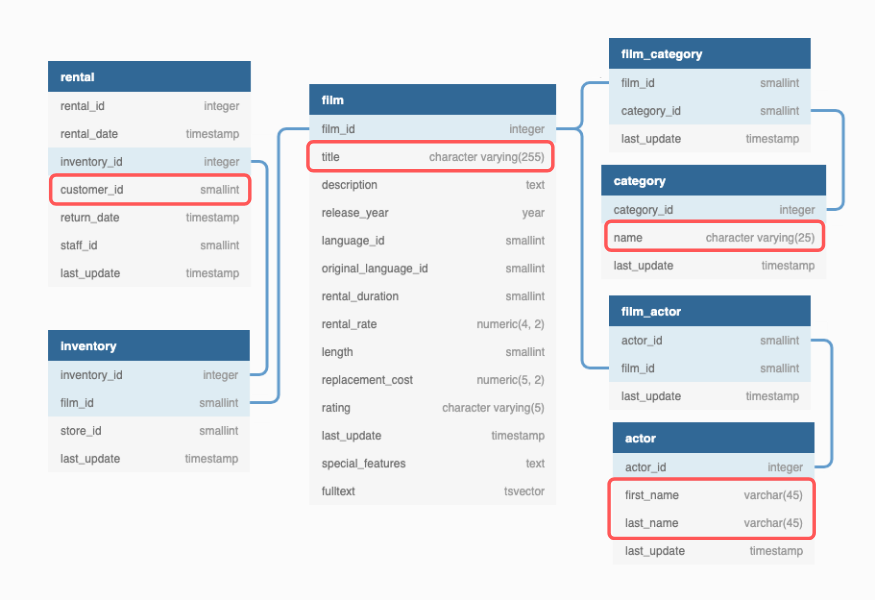

# Problem Approach

The reverse-engineering strategy was used for the problem approach. This strategy focuses on working backwards from the result or target state.

The email template was looked from top to bottom to get ideas on how the final SQL output should be.

9 important points were taken from the email template.

**Category Data Points**

1. Top ranking category name: ``cat_1``
2. Top ranking category customer insight: ``insight_cat_1``
3. Top ranking category film recommendations: ``cat_1_reco_1``, ``cat_1_reco_2``, ``cat_1_reco_3``
4. 2nd ranking category name: ``cat_2``
5. 2nd ranking category customer insight: ``insight_cat_2``
6. 2nd ranking category film recommendations: ``cat_2_reco_1``, ``cat_2_reco_2``, ``cat_2_reco_3``

**Actor Data Points**

1. Top actor name: ``actor``
2. Top actor insight: ``insight_actor``
3. Actor film recommendations: ``actor_reco_1``, ``actor_reco_2``, ``actor_reco_3``

The final output would have the above columns and there would be a single row for each ``customer_id``. 

The final table would be like the one below:

| customer_id | cat_1    | cat_1_reco_1        | cat_1_reco_2      | cat_1_reco_3      | cat_2     | cat_2_reco_1   | cat_2_reco_2   | cat_2_reco_3        | actor          | actor_reco_1      | actor_reco_2         | actor_reco_3    | insight_cat_1                                                                                                                   | insight_cat_2                                                                    | insight_actor                                                                                                         |
|-------------|----------|---------------------|-------------------|-------------------|-----------|----------------|----------------|---------------------|----------------|-------------------|----------------------|-----------------|---------------------------------------------------------------------------------------------------------------------------------|----------------------------------------------------------------------------------|-----------------------------------------------------------------------------------------------------------------------|
| 1           | Classics | Timberland Sky      | Gilmore Boiled    | Voyage Legally    | Comedy    | Zorro Ark      | Cat Coneheads  | Operation Operation | Val Bolger     | Primary Glass     | Alaska Phantom       | Metropolis Coma | You’ve watched 6 Classics films,   that’s 4 more than the DVD Rental Co average and puts you in the top 1% of   Classics gurus! | You’ve watched 5 Comedy films   making up 16% of your entire viewing history!    | You’ve watched 6 films featuring   Val Bolger! Here are some other films Val stars in that might interest you!        |
| 2           | Sports   | Gleaming Jawbreaker | Talented Homicide | Roses Treasure    | Classics  | Frost Head     | Gilmore Boiled | Voyage Legally      | Gina Degeneres | Goodfellas Salute | Wife Turn            | Dogma Family    | You’ve watched 5 Sports films,   that’s 3 more than the DVD Rental Co average and puts you in the top 7% of   Sports gurus!     | You’ve watched 4 Classics films   making up 15% of your entire viewing history!  | You’ve watched 5 films featuring   Gina Degeneres! Here are some other films Gina stars in that might interest   you! |
| 3           | Action   | Rugrats Shakespeare | Suspects Quills   | Handicap Boondock | Animation | Juggler Hardly | Dogma Family   | Storm Happiness     | Jayne Nolte    | English Bulworth  | Sweethearts Suspects | Dancing Fever   | You’ve watched 4 Action films,   that’s 2 more than the DVD Rental Co average and puts you in the top 14% of   Action gurus!    | You’ve watched 3 Animation films   making up 12% of your entire viewing history! | You’ve watched 4 films featuring   Jayne Nolte! Here are some other films Jayne stars in that might interest   you!   |

The components of the final SQL output table were isolated to have a better focus on the problem solving. The requirements for each of the components are explained in present tense because it was an ideation of how the components were supposed to look like.

## Top Categories Information
To create each **customer insight** the following inputs are needed:

- **category_name:** The name of the top or second ranking category
- **rental_count:** How many total films have they watched in this category?
- **average_comparison:** How many more films has the customer watched compared to the average DVD Rental Co customer?
- **percentile**: How does the customer rank in terms of the top X% compared to all other customers in this film category?
- **category_percentage:** What proportion of each customer’s total films watched does this count make?

| customer_id | category_ranking | category_name | rental_count | average_comparison | percentile | category_percentage |
|-------------|------------------|---------------|--------------|--------------------|------------|---------------------|
| 1           | 1                | Classics      | 6            | 4                  | 1          | 19                  |
| 1           | 2                | Comedy        | 5            | 4                  | 2          | 16                  |
| 2           | 1                | Sports        | 5            | 3                  | 7          | 19                  |
| 2           | 2                | Classics      | 4            | 2                  | 11         | 15                  |

## Top Actor Information

For the top actor the ``rental_count`` is needed as well as the first name and full name for the corresponding actor insight.

| actor_id | first_name | actor_name     | rental_count |
|----------|------------|----------------|--------------|
| 37       | Val        | Val Bolger     | 6            |
| 107      | Gina       | Gina Degeneres | 5            |

## Category Recommendations

In this table each ``customer_id`` has the 3 movie recommendations for the first top category and the 3 movies recommendations for the second top category.

| customer_id | cat_1_reco_1        | cat_1_reco_2      | cat_1_reco_3   | cat_2_reco_1 | cat_2_reco_2   | cat_2_reco_3        |
|-------------|---------------------|-------------------|----------------|--------------|----------------|---------------------|
| 1           | Timberland Sky      | Gilmore Boiled    | Voyage Legally | Zorro Ark    | Cat Coneheads  | Operation Operation |
| 2           | Gleaming Jawbreaker | Talented Homicide | Roses Treasure | Frost Head   | Gilmore Boiled | Voyage Legally      |

## Actor Recommendations

This category needs the 3 film recommendations by the customer's top actor.

| customer_id | actor_reco_1      | actor_reco_2   | actor_reco_3    |
|-------------|-------------------|----------------|-----------------|
| 1           | Primary Glass     | Alaska Phantom | Metropolis Coma |
| 2           | Goodfellas Salute | Wife Turn      | Dogma Family    |

## Identifiying Key Columns

The key columns from the ERD were identified to proceed with the joining of tables.

## Join Implementation

In the next section the approach on doing the joins was explained and also how the two base tables for the category and actor insights were generated.

Please make sure to click on the link below to go to the next part.

